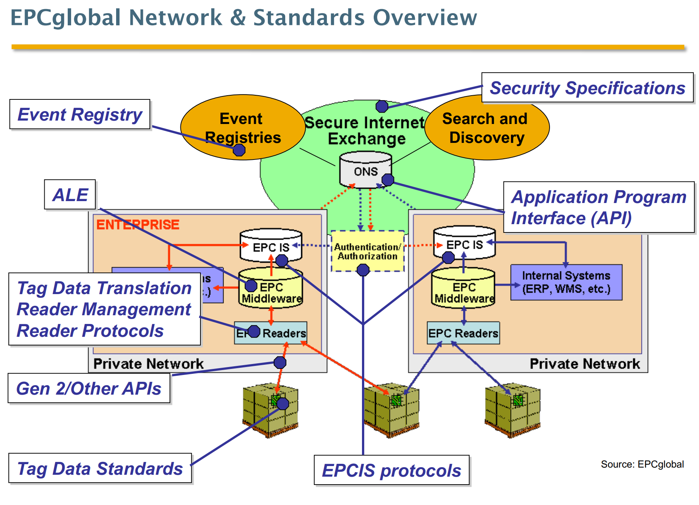

- Electronic Product Code
- 
- Gemeinsamer Standard zum Austausch von RFID Tag Daten
- Spezielle Reader und Tags
- EPC IS
	- EPC **I**nformation **S**ystem
	- Es werden automatisch verschiedene Prozesse angestoßen [[Goods Receipt]] u.ä.
	- Jedes Unternehmen betreibt eigenes EPC IS
	- [[EPCglobal/ONS]] vermittelt richtiges EPC IS für Informationsssuche über einen gewissen Tag.
		-
	-
	-