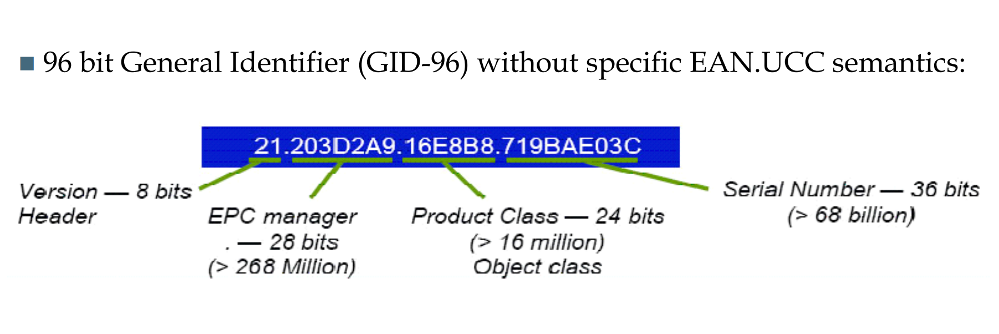

- Electronic Product Code
- 
	- Dieser Fall ist eine SGTIN: Serialisierte Version eine GTIN
- Version
	- Spezifiziert z.B. Länge von Product Class und Serial Number
		- Erlaubt es Kleine Serien vieler unterschiedlicher Produktklassen und große Serien von wenigen verschiedenen Produktklassen zu erzezgen
- EPC Manager
  id:: 6585647f-86d5-460e-9604-2deaa7f8730f
	- Kann der Tag Hersteller oder das Produzierende Unternehmen sein
		- Kommt auf die Informationen an die zur Produktionszeitpunkt des Tags zur Verfügung stehen.
- Product Class
	- Produktklasse
-