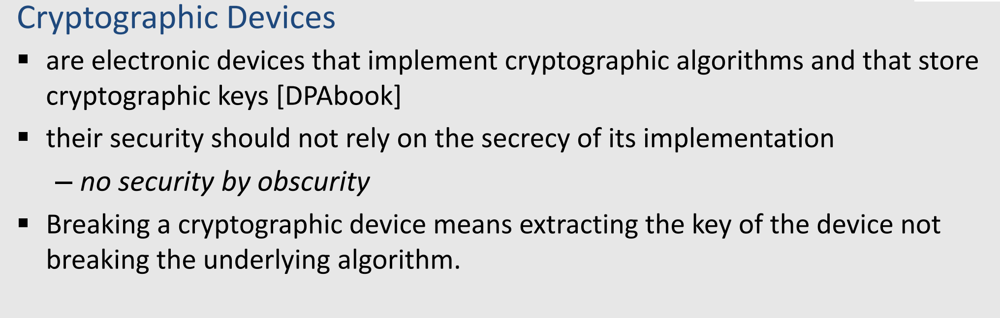

# Definition
- 
	- Aus der Vorlesung [[Winter 2023/PACs]]
- Kryptografische Geräte sind elektronische Geräte, die kryptografische Algorithmen implementieren und kryptografische Schlüssel speichern.
- Ihre Sicherheit sollte nicht auf der Geheimhaltung ihrer Implementierung basieren, sondern auf anderen Sicherheitsmechanismen.
- Wenn ein kryptografisches Gerät gebrochen wird, bedeutet das, dass der Schlüssel des Geräts extrahiert wird, nicht der zugrunde liegende Algorithmus. #Kryptographie
- # Beispiele
-
- ## Bezahlfernsehen-System
  Der Rundfunksender gibt Smartcards an seine Kunden aus, und die Kunden zahlen dafür, den Inhalt anzusehen.
- Der Rundfunksender kann nicht davon ausgehen, dass alle Kunden ehrlich sind. Tatsächlich könnte ein Kunde seine Karte duplizieren wollen, um auch seinen Freunden die Möglichkeit zu geben, den Inhalt zu sehen.
- ## Weitere Beispiele
- Elektronisches Geld (im Chip der Bankkarten)
- Ausweise, Pässe
- Autofernbedienungen/Wegfahrsperren
- USB-Token
- RFID-Tags
	- Smartcards waren der Ausgangspunkt,
	  sind aber immer noch sensible Fälle
- Mehrere kryptographische Geräte sind in unserem täglichen Leben involviert
	- Es besteht auch ein großes Interesse daran, sie zu knacken
		- Für finanzielle Vorteile, Spaß, illegales Kopieren
- # Angriffsszenarien
- Der Angreifer ist ein legitimer Besitzer des Geräts
	- Er kann das Gerät benutzen und zeigen, dass er ein ehrlicher Besitzer ist
	- Er kann das Gerät manipulieren, stören und beobachten
- Ziel
	- Geheimen Schlüssel zu finden
		- Sobald der geheime Schlüssel offengelegt ist, ist die Sicherheit dahin...
		- Später kann sie den offengelegten Schlüssel für andere Zwecke verwenden
		- Entschlüsselung der Kommunikation anderer
		- Fälschung der Inhalte, ...
		- Illegaler Zugriff auf gesicherte Objekte
- ## Beispiele für Angriffsszenarien
- Physischer Angriff bedeutet, die physischen Eigenschaften des kryptographischen Geräts zu verwenden, um es zu knacken.
	- dann wird **PHYSIKALISCHER ZUGRIFF** auf das Gerät benötigt
- Wir beginnen mit einem Beispiel:
	- Eve findet einen USB-Stick mit geheimen Daten darauf
	- Um auf diese geheimen Informationen zuzugreifen, muss eine 8-stellige PIN korrekt eingegeben werden
	-
- Das Gerät hat eine verzögerte Antwort - ein Versuch dauert also 1s.
	- Für einen Brute-Force-Angriff gibt es 10^8 mögliche PIN-Codes
	- Das Ausprobieren aller möglichen PINs dauert 10^8 s ≈ 1157 Tage ≈3 Jahre
		- Kann sie einen besseren Angriff finden?
- ## Erkenntniss
- Die Stringcompare Methode muss gefixt werden
- Laufzeit muss unbedingt unabhängig von Eingabe und dem gespeicherten Schlüssel sein
-
-