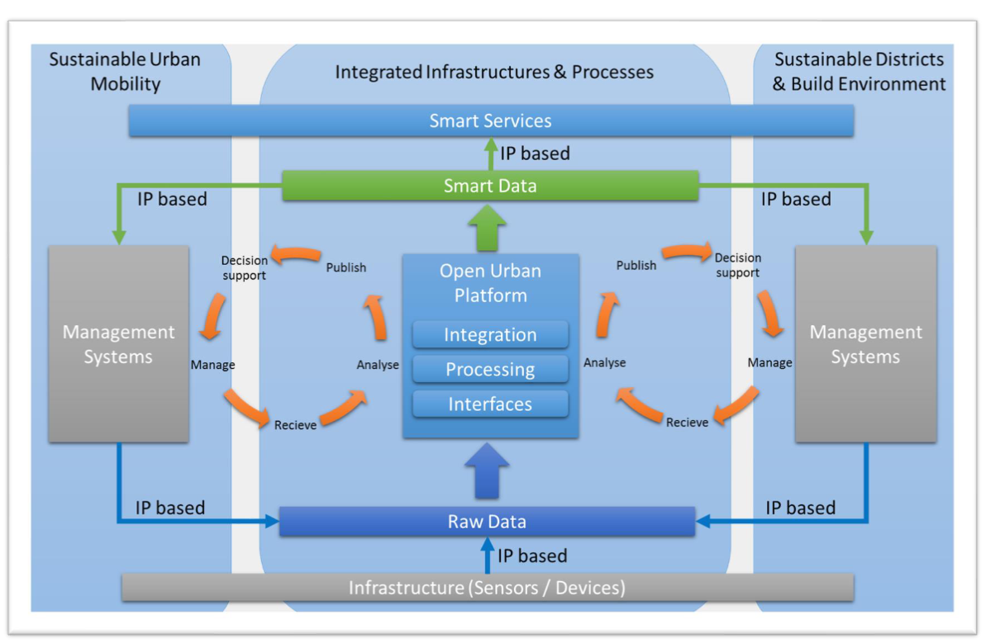

file:: [Ubicomp-Biz-2022-Part-III-LH_1705049729133_0.pdf](../assets/Ubicomp-Biz-2022-Part-III-LH_1705049729133_0.pdf)

- # Definition
	- **Open Data** bezieht sich auf Datensätze, die von öffentlichen Behörden und Unternehmen der Öffentlichkeit zur Verfügung gestellt werden.
	- Häufig wird dieser Begriff auch verwendet, um die Nutzung der Datensätze als "kostenlos" zu definieren, indem eine entsprechende Open-Data-Lizenzvereinbarung verwendet wird.
	- Open Data ist offen, wenn die bereitgestellten **Daten von jedermann und für jeden Zweck verarbeitet und genutzt werden können**. Im Allgemeinen soll Open Data Kriterien wie "Aktualität", "so nah wie möglich an der Datenquelle", "Veröffentlichung unter einer offenen Lizenz" wie von den Creative Commons1 veröffentlicht, entsprechen.
	- Offene urbane Datenplattformen sind datengesteuerte Architekturen.
	- Daten fließen von externen Systemen zur OUP entweder durch die Bereitstellung von APIs oder durch das Pushen von Daten, zum Beispiel über E-Mail.
		- Erlabut es, dass externe Systeme unberührt von OUP arbeiten können. Die Systemhoheit bleibt dadurch bei den Fachabteilungen / Einheiten.
		- Zugriffe auf andere Systeme kann durch diese Architektur verhindert werden.
	- Smarte Gegenstände könnten ihre Daten direkt an die OUP senden oder über ein gegebenes Managementsystem.
	- Eingehende Daten werden als "**Rohdaten**" bezeichnet, da die Daten im ursprünglichen, oft proprietären Format bereitgestellt werden.
	- Die OUP harmonisiert die Daten und verarbeitet sie so, dass konsumierbare Daten erzeugt werden, die als "** [[Smart Data]] **" bezeichnet werden.
		- Das OUP macht aus proprietären Steuersignalen einer Ampel zB Daten zum Zustand der Ampel in einem Standard-Format
		- In machen Fällen gibt es für einen Anwendungsfall mehrere Lösungen und Systeme die verschiedene Arten und Strukturen von Daten geben - diese müssen dann entsprechend aufbereitet werden
			- Beispiel: Freie Parkplätze. Überwachung der Parkplätze über Boden-Druck-Sensor, Ultraschallsensoren oder Kamera möglich.
				- Alle Sensorarten ermöglichen die Überwachung freier ParkplätzeA
				- Alle Systeme liefern unterschiedliche Daten
				- Müssen harmonisiert und auf zentralen Wert ("Welcher Parkplatz ist frei" ) reduziert werden.
				-
	- Die Ausgabe wird von Smart Services wie Apps oder von anderen Managementsystemen zur weiteren Verarbeitung konsumiert.
- # Open Urban Data Platform
  collapsed:: true
	- ## Definition
		- Offene Stadtplattformen sind vernetzte Systeme, die die Sammlung, Integration und Verwendung verschiedener Arten von Stadt- und Bürgschaftsdaten ermöglichen, um die Verwaltung und das Management von städtischen Diensten zu verbessern.
	- Sie erleichtern die Nutzung von städtischen Daten und die intelligente Überwachung und Steuerung der Infrastruktur und des Vermögens in Städten und ermöglichen damit neue und verbesserte Dienstleistungen (sowohl für den öffentlichen und privaten Sektor als auch für Organisationen). Man kann sie als System von Systemen sehen, bestehend aus bestehenden und neuen Elementen und sich mit der Zeit weiterentwickeln. Eine offene Stadtplattform integriert (bisher) abgeschottete städtische Infrastrukturen, Datenplattformen und Dienste aus verschiedenen Bereichen. Einfacher ausgedrückt, integrieren Stadtplattformen IOT-fähige Infrastrukturen und Vermögenswerte in Städten, ermöglichen es, diese zu betreiben und Daten von diesen und anderen Quellen zu erfassen und (neu) zu verteilen/nutzen und stellen diese Anwendungen zur Verfügung.
	- ## Informationen im Zusammenhang mit dem Themefeld Staatliche Kommune:
		- Stadtplattformen können dazu beitragen, eine effektivere und effizientere Bereitstellung von kommunalen Dienstleistungen zu ermöglichen.
		- Sie können helfen, die Datentransparenz und -sicherheit zu erhöhen, indem sie den Zugang zu und die Nutzung von städtischen Daten erleichtern.
		- Plattformen dieser Art können auch zur Verbesserung der städtischen Infrastruktur, zur Erhöhung der Energieeffizienz und zur Reduzierung der Umweltauswirkungen beitragen.
		- Sie können außerdem neue Geschäftsmodelle ermöglichen und die Zusammenarbeit zwischen öffentlichen und privaten Akteuren fördern.
		- Offene Stadtplattformen können auch wichtige Werkzeuge für die partizipative Stadtplanung sein, indem sie Bürgern, Unternehmen und Entscheidungsträgern verbesserte Informationen und Analysemöglichkeiten bieten.
	- ## Aktueller Stand
		- Aktuell werden auf den Datenportalen der Städte eher statische Daten angezeigt, keine Dynamische Daten
			- ### Beispiel
				- Es werden Behindertenparkülätze angezeigt (WO).
					- Die Aktuelle Belegung wird nicht angezeigt
				- Es wird eine Einwohnerzahl zu einem Stichtag angezeigt
					- Die aktuellen An- und Abmeldungszahlen werden nicht angezeigt, obwohl diese bereits heute erhoben werden (können)
- # DIN SPEC 91357
  collapsed:: true
	- 
	- **Decision Support**
		- Messung von Luftqualität zur Steuerung des Verkehrsflusses um regulatorische Maßnehmen einzuhalten
- # Lifecycle
  collapsed:: true
	- Empfangen
		- OUP nimmt die "Rohdaten" sowohl von Managementsystemen als auch von "intelligenten" Gegenständen entgegen
	- Analyse
		- Harmonisierung der Eingabedaten, um eine integrierte Analyse zu ermöglichen
		- Analyse mit KI-Tools wie Machine-Learning-Algorithmen
	- Veröffentlichung
		- Über OpenAPIs wird " [[Smart Data]] " für den Verbrauch durch intelligente Dienste und Managementsysteme veröffentlicht
			- OpenAPIs sind keine OpenData!
				- OpenAPIs heißt, dass diese API dokumentiert und öffentlich ist.
				  Nur wenn ich auch zum Datenabruf in der Lage bin ist es OpenData.
		- Oder über ein bestimmtes Managementsystem
	- Entscheidungsunterstützung
		- Basierend auf den " [[Smart Data]] " führen bessere Einsichten zu Datengeleiteten Entscheidungen (verweis auf High Resolution Enterprise Management)
	- Verwalten
		- Basierend auf den gebildeten Entscheidungen können Prozesse angepasst werden
	-
- # Beispielstädte
	- Städte stellen Open Data Portale zur Verfügung, um ihre öffentlichen Daten zu teilen, zum Beispiel:
		- https://daten.berlin.de/ (Berlin Open Data)
		- https://www.offenedaten-koeln.de/ (Offene Daten Köln)
	- Problem: Die meisten offenen Datensätze liefern keine Echtzeitdaten, d.h., sie enthalten keine Echtzeitdaten von intelligenten Geräten.