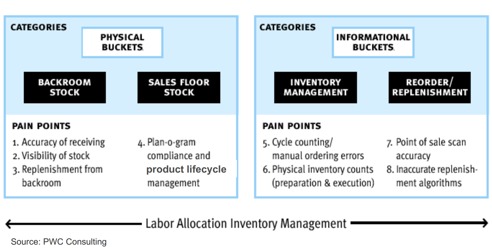

- 
- 4. [[Plan-o-gram]]
- 7. Fehler der Kassier*in
- 8. Wann liefere ich nach?
	- Wenn Ware leer ist im Regal: Worst-Case
	- Je mehr Transparenz in den Lagerbestand und Daten über den Abgang von Daten desto besser.